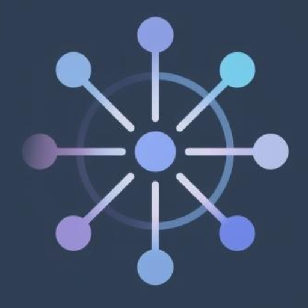

  

<h1 align="center">Nexus</h1>

  
  
  
  

  Nexus is a lightweight productivity desktop app designed to streamline your workflow.

  Manage your tasks, notes, code snippets, and RSS feeds all in one place, with a built-in timer to keep you focused.

---

## Documentation

For detailed instructions on building, installing, and packaging Nexus, please refer to the [**Documentation**](docs/Readme.md).

-   [**Building and Installing**](docs/Building-and-Installing.md)
-   [**Packaging**](docs/Packaging.md)
-   [**List of Dependencies**](docs/List-of-dependencies.md)
-   [**API Documentation**](docs/api.md)

## Features

**Note Taking** - Capture your thoughts and ideas with a clean, distraction-free editor

**Task Management** - Organize your to-dos and track your progress effortlessly

**Code Snippets** - Store and manage reusable code snippets for quick access

**Timer** - Built-in Pomodoro or custom timer to boost productivity

**RSS Reader** - Stay updated with your favorite feeds without leaving the app

## Download

Nexus is available for Linux, macOS, and Windows.

**[Download the latest release](https://github.com/ajthr/nexus/releases/latest)**

## License

Nexus is licensed under the [MIT License](LICENSE).

## Acknowledgments

Built with passion and these amazing technologies:

- [Electron](https://electronjs.org)
- [React](https://reactjs.org)
- [Vite](https://vitejs.dev)

---
